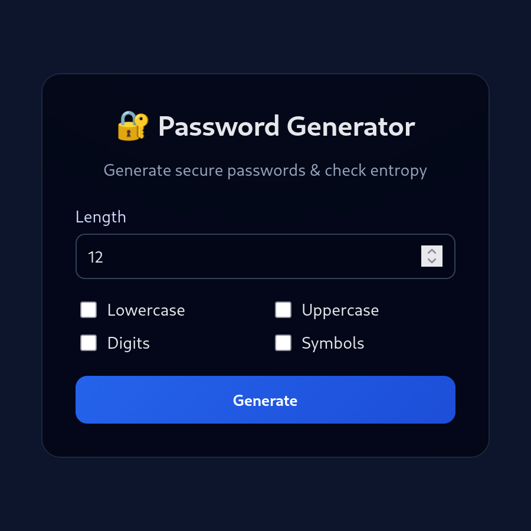

# 🔐 Password Generator & Strength Checker

Веб-приложение для генерации криптографически стойких паролей и оценки их энтропии.

Проект использует **FastAPI**, **Pydantic**, **Jinja2** и современный UI.

---




## ✨ Возможности

* Генерация паролей с выбором:

  * Длина (4–128 символов)
  * Строчные буквы
  * Заглавные буквы
  * Цифры
  * Специальные символы
* Проверка силы пароля с подробным **отчётом**:

  * Энтропия (бит)
  * Доля уникальных символов
  * Доля повторяющихся паттернов
  * Длина ASCII-последовательностей
  * Длина клавиатурных последовательностей
  * Чисто цифры или нет
  * Проверка словаря популярных паролей
* Веб-интерфейс с сохранением выбранных опций и отображением ошибок
* Поддержка копирования сгенерированного пароля в буфер обмена
* Настраиваемые коэффициенты энтропии через конфиг

---

## 📦 Структура

- `backend/` — FastAPI backend
- `frontend/` — Клиентская часть


---

## ⚙ Установка

### 1. Клонируем репозиторий:

```bash
git clone https://github.com/Akxios/password-generator-web.git
cd password-generator-web
```

### 2. Установка зависимостей (uv)

Убедись, что uv установлен:
```bash
pip install uv
```
Установка зависимостей для работы backend:
```bash
uv sync
```

### 3. Запуск сервера:
```bash
uv run python -m backend
```
или
```bash
python -m backend
```

После запуска приложение будет доступно по адресу:
```bash
http://127.0.0.1:8000
```
Документация к API будет допуступна по адресу:
```bash
http://127.0.0.1:8000/docs
```

---

## 🛠 Конфигурация

* **backend/services/config.py**
  Хранит словари и клавиатурные последовательности:

```python
KEYBOARD_SEQS = ["qwertyuiop", "asdfghjkl", "zxcvbnm", "1234567890"]
COMMON_PASSWORDS = {"password", "123456", "qwerty", "admin", "letmein", "welcome"}
```

* **backend/config.py**
```python
MIN_PASSWORD_LENGTH = 4
MAX_PASSWORD_LENGTH = 128
DEFAULT_PASSWORD_LENGTH = 12

ENTROPY_COEFS = {
    "short_passwords": [
        {"max_length": 8, "factor": 0.4},
        {"max_length": 12, "factor": 0.75},
    ],
    "unique_ratio": 1.5,
    "ascii_sequence": 0.6,
    "keyboard_sequence": 0.5,
    "digits_only": 0.3,
    "dictionary": 0.05,
}
```
Можно менять допустимые значения для генерации пароля.
А также, чтобы регулировать вес разных факторов при оценке сложности пароля.

---

## 📝 Пример отчёта о пароле

```json
{
  "entropy": 32.26,
  "length": 12,
  "unique_ratio": 1,
  "repeat_ratio": 0,
  "ascii_sequence": 2,
  "keyboard_sequence": 1,
  "digits_only": false,
  "in_dictionary": false,
  "password": "W&?J6U5-.Ce$"
}
```

---

## 📦 API

* **POST /api/generate** – генерация пароля, возвращает отчёт
* **POST /api/check** – проверка существующего пароля, возвращает отчёт

---

## 💻 Frontend

* HTML + CSS с использованием Jinja2
* Сохраняет выбранные параметры после отправки формы
* Ошибки выводятся прямо под формой
* Сгенерированный пароль можно скопировать с помощью JS
